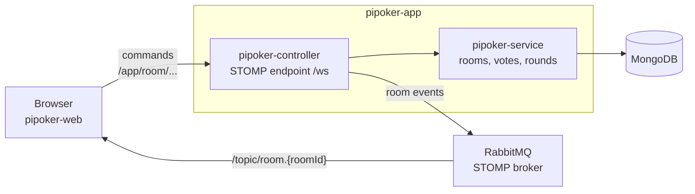
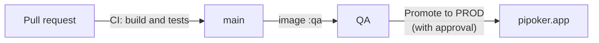

<div align="center">


# PiPoker backend

**The real-time server behind [PiPoker](https://pipoker.app), free online Planning Poker without registration.**

[**pipoker.app**](https://pipoker.app) &nbsp;·&nbsp;
[Web client](https://github.com/LordDetson/pipoker-web) &nbsp;·&nbsp;
[Server setup](https://github.com/LordDetson/pipoker-docker-config) &nbsp;·&nbsp;
[Support the project](https://lorddetson.github.io/)

[](https://github.com/LordDetson/pipoker-app/actions/workflows/ci.yml)
[](https://pipoker.app)
[](LICENSE)


</div>

## What it does

PiPoker rooms have a card deck, voters and watchers. The server keeps every room, takes the commands people send
from their browsers and tells everyone in the room what changed, at once:

- 🚪 **Rooms and people:** create a room, join as a voter or a watcher, switch roles, leave.
- 🃏 **Rounds:** votes stay hidden until the cards are revealed, by a button or as soon as every voter has voted.
  The accepted estimate and the round's task are saved with the round.
- 🗂️ **History:** the last rounds of each room, for the history panel and its export.
- ⏱️ **Timer:** one discussion countdown shared by the whole room.
- 🔄 **Presence:** a page refresh keeps the seat, a closed tab frees it at once, a lost connection frees it after a
  short grace period. Rooms idle for 30 minutes close by themselves.
- 💬 **Feedback:** reports sent from the site go to Jira.

## Architecture



A Spring Boot application on Java 25, built with Maven:

| Module | What it holds |
|--------|---------------|
| `pipoker-service` | Rooms, participants, votes and rounds, kept in MongoDB. A room changes by atomic updates (`AtomicRoomRepository`), so people acting at the same moment don't overwrite each other. |
| `pipoker-controller` | The runnable application. Clients talk to it over STOMP on the WebSocket endpoint `/ws`: they send commands to `/app/room/...` and receive the room's events from `/topic/room.{roomId}` through RabbitMQ, which serves as the STOMP broker. It also tracks who is still connected, closes idle rooms, accepts feedback at `/api/feedback`, counts visits by their source at `/api/visits` and serves metrics for the activity dashboard on the internal port 8081. |

## Getting started

You need **Java 25**; Maven comes with the wrapper. The application needs MongoDB and RabbitMQ with the STOMP plugin.
The easiest way to get the whole stack is `server/compose.yml` in
[pipoker-docker-config](https://github.com/LordDetson/pipoker-docker-config).

```bash
./mvnw verify      # build and run every test
```

### Configuration

| Variable | Meaning |
|----------|---------|
| `APP_PORT` | HTTP port, 8080 by default |
| `STOMP_ALLOWED_ORIGINS` | Page origins allowed to open the room WebSocket; any origin when unset, which is only meant for local development |
| `BROKER_HOST`, `STOMP_BROKER_PORT` | RabbitMQ with the STOMP plugin; the port is 61613 by default |
| `STOMP_BROKER_SYSTEM_LOGIN`, `STOMP_BROKER_SYSTEM_PASS`, `STOMP_BROKER_USER_LOGIN`, `STOMP_BROKER_USER_PASS` | RabbitMQ credentials |
| `MONGODB_HOST`, `MONGODB_PORT`, `MONGODB_DBNAME`, `MONGODB_USR`, `MONGODB_PASS` | MongoDB; the port is 27017 by default |
| `JIRA_URL`, `JIRA_EMAIL`, `JIRA_API_TOKEN`, `JIRA_PROJECT`, `PIPOKER_ENV` | Where feedback from the site goes; without them it is only written to the log |

## Tests

`./mvnw verify` runs all tests and writes coverage reports to `*/target/site/jacoco`.

- **Unit tests** (`*Test`) need nothing but Java 25: `./mvnw test`.
- **Integration tests** (`*IT`) start MongoDB and RabbitMQ in Docker with Testcontainers and drive the application
  over STOMP the way the web client does. They need a running Docker; skip them with `./mvnw verify -DskipITs`.

## Releases



GitHub Actions ([`ci.yml`](.github/workflows/ci.yml)) builds and tests every pull request. Every push to main also
publishes the image `ghcr.io/lorddetson/pipoker-controller`, which the QA environment picks up within a few minutes.
A commit checked on QA goes to PROD through the **Promote to PROD** workflow
([`promote.yml`](.github/workflows/promote.yml)), which waits for approval and then publishes a
[release](../../releases) named after the day, with the pull requests that went to PROD.

## Contributing

Ideas, bug reports and pull requests are welcome: open an [issue](https://github.com/LordDetson/pipoker-app/issues)
or use the **Feedback** button on [pipoker.app](https://pipoker.app). If PiPoker helps your team, you can
[support its development](https://lorddetson.github.io/).

## License

PiPoker is released under the [Apache License 2.0](LICENSE).
